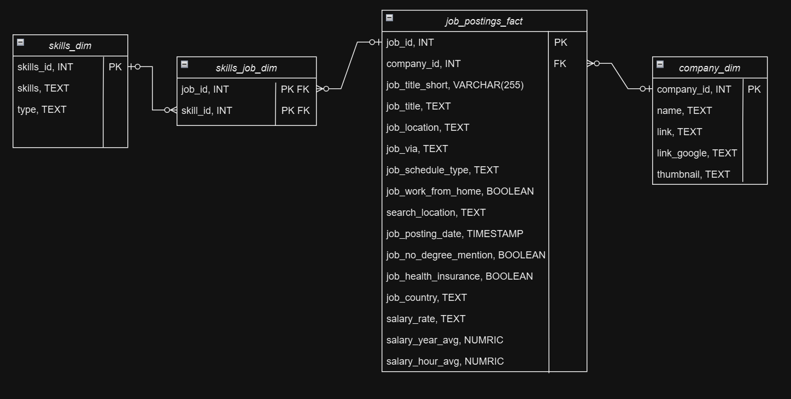
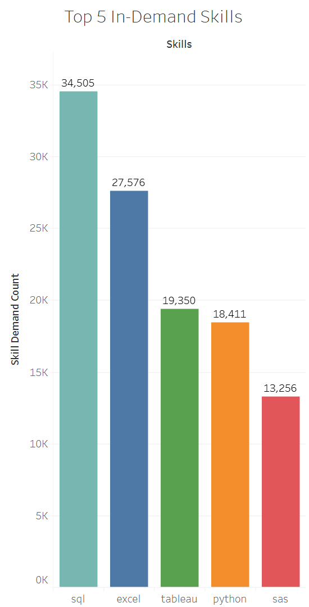
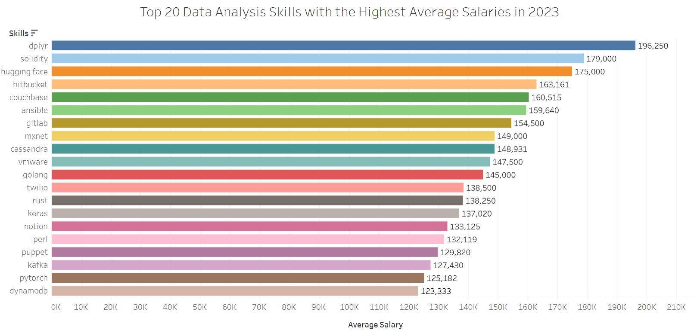
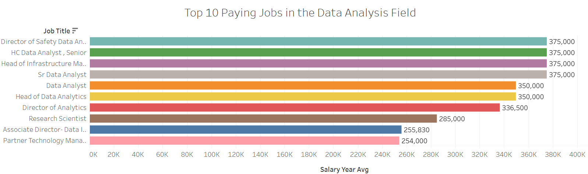
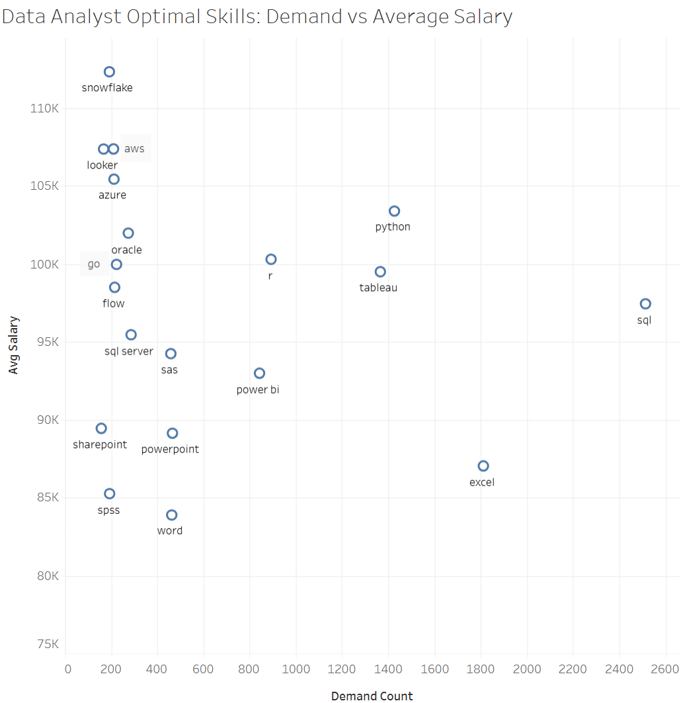

# Data Analyst Job Market Analysis

## Project Background
This project analyzes job postings for Data Analyst roles in the US to identify top-paying skills, companies who offer the highest-paying job opportunities, most demanded skills, and optimal skills that combine both high demand and competitive salaries.

The analysis is conducted through a series of SQL queries designed to answer key questions about the job market for Data Analysts in the US. Insight are provided on the following key areas:

Top Paying Skills: Identify the highest-paying skills for Data Analysts in the US.

Top Paying Job: Identify the jobs offering the highest-paying Data Analyst positions in the US.

Top Demanding Skills: Find out which skills are most frequently required for Data Analyst roles in the US.

Optimal Skills: Identify skills that are both in high demand and offer competitive salaries.

### Tools Used
- Visual Code Studio
- PostgreSQL 

## Data Structure
The dataset is comprised of +100,000 data analysis job posting data from the US scraped from across several job board website such as Indeed, Linkedin, Monster, etc... from 12/31/2022 - 12/31/2023.

The database structure as seen below contains 4 tables: skills_dim, skills_job_dim, job_postings_fact, company_dim.

## Analysis and Insights

In-Demand Skills: The most demanded skills in VA for Data Analysts are "SQL", "Excel", "Tableau", "Python", and "SAS." These skills are crucial for securing a Data Analyst position, as they are frequently requested by employers. [Click here to view query](/project_sql/top_damanding_skills.sql)

Top Paying Skills: The analysis reveals that the "dplyr", a R programming language library, is the highest-paying skill for Data Analysts in the US, offering an average salary of $196,250. Other high-paying skills include "solidity", "hugging face", "bitbucket", and "couchbase" indicating that proficiency in specialized tools, programming languages, and libraries can increase earning potential. [Click here to view query](/project_sql/top_paying_skill.sql)

Top Paying Jobs: The highest-paying Data Analyst positions in the U.S. are Director of Safety Data Analysis, Senior Health Care Data Analyst, Head of Infrastructure Management & Data Analytics, and Senior Data Analyst, all earning a yearly salary of $375,000. Head of Data Analytics and Director of Analytics follow closely behind with salaries of $350,000 per year. This analysis shows that director and senior-level roles typically offer the highest salaries within the data analyst field. [Click here to view query](/project_sql/top_paying_Company.sql)

Optimal Skills: The optimal skills, which combine high demand with competitive salaries, include "SQL", "Excel", "Python", "Tableau," and "R." These skills not only offer a strong salary but are also frequently required, making them valuable for career advancement.  [Click here to view query](/project_sql/optimal_skills.sql)

## Conclusion
This analysis provides valuable insights into the skills and qualifications that can lead to higher salaries and better job opportunities for Data Analysts in the US. Professionals aiming to maximize their earning potential should focus on acquiring and refining skills such as "SQL," "Excel," "Python," and "Tableau," while also considering programming lanuages, libraries, and specialized tools like "dplyr" and "Solidity," which are associated with top-paying roles. Additionally, targeting senior and director-level positions can significantly enhance earning potential in the data analyst field.
